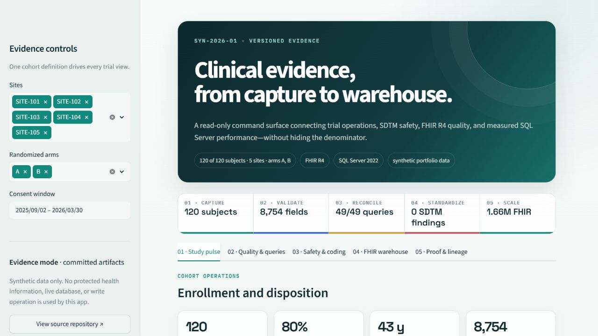
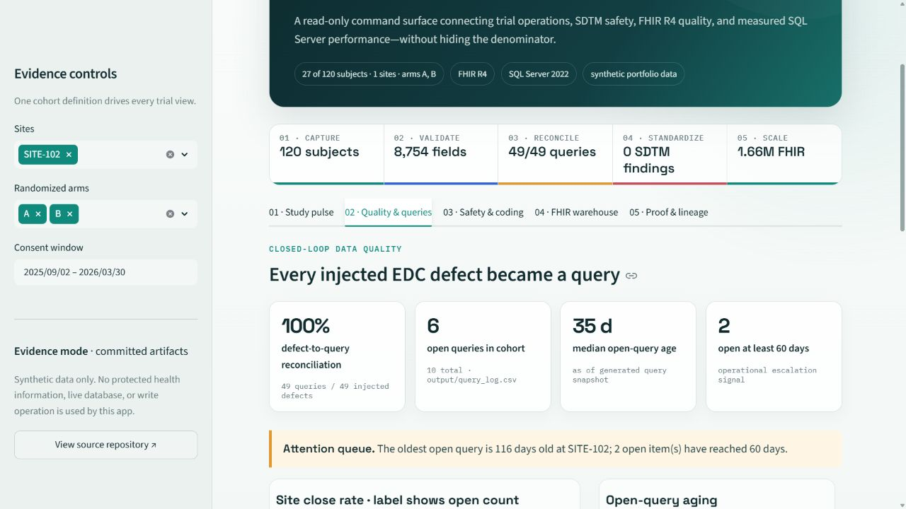
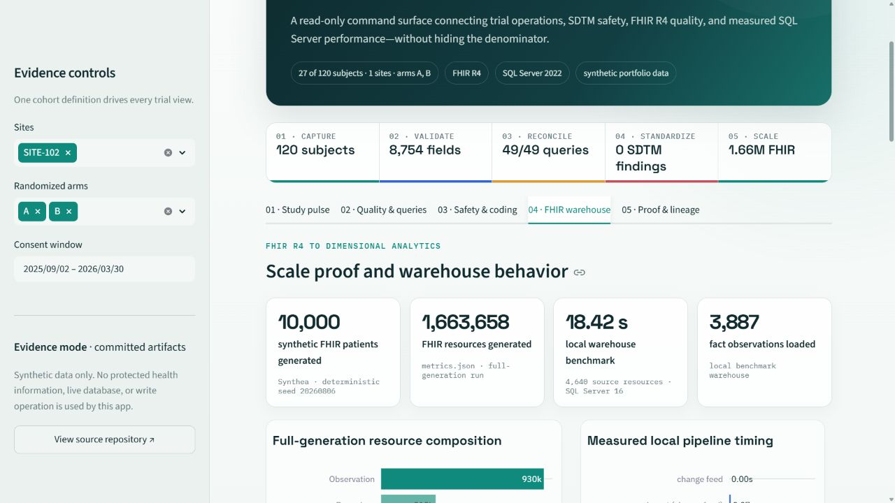
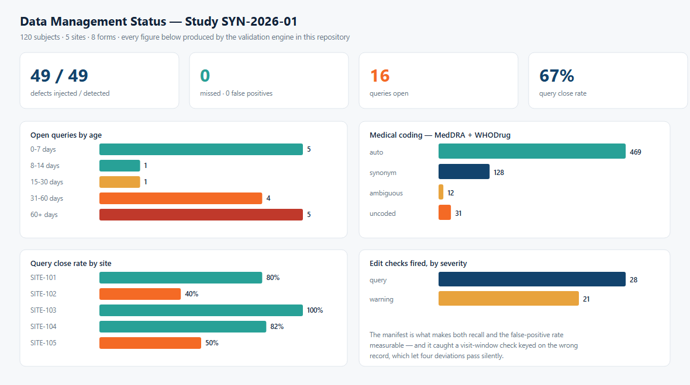
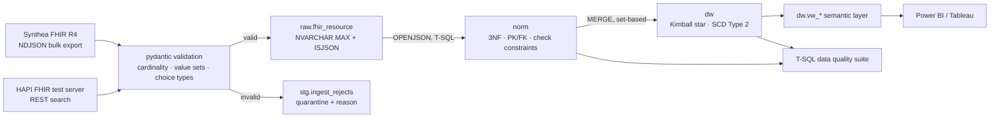

# Clinical Data Management — trial build, FHIR ingestion, and a SQL Server warehouse

[](https://github.com/KushPatel29/clinical-data-management/actions/workflows/ci.yml)
[](https://kush-clinical-data-dashboard.streamlit.app/)


Two halves of the same problem, in one repository.

**The trial side.** A clinical study built the way any other regulated system
should be: the CRF as version-controlled metadata, the Data Validation
Specification as executable declarations, the SDTM mapping decided at design
time, and a UAT plan generated from the specification rather than written from
memory. Standard library only, no database, runs anywhere in seconds.

**The health-system side.** HL7 FHIR R4 landing in SQL Server 2022 as raw JSON,
shredded with `OPENJSON` into a third-normal-form model with real constraints,
then loaded into a Kimball star schema with a Type 2 patient dimension. Two
ingestion paths — a bulk export and a live REST API — with everything that
implies about pagination, backoff, and resources that do not conform.

They meet in one place: **before a trial opens at a site, somebody has to answer
"how many of your patients could even be eligible".** That question is asked of
the hospital's warehouse, not of the EDC, because the EDC has no patients in it
yet. `dw.vw_trial_feasibility` is that count.

Everything here is synthetic. No real trial, no real patients, no PHI.

## Live evidence console

[](https://kush-clinical-data-dashboard.streamlit.app/)

<p align="center">
  <strong><a href="https://kush-clinical-data-dashboard.streamlit.app/">Launch the interactive Clinical Evidence Console →</a></strong><br>
  Five linked views · one coherent cohort · synthetic data only
</p>

The console is a read-only view over the versioned evidence in this repository.
Site, arm, and consent-window controls apply one cohort across enrollment,
query operations, safety, coding, and vital signs. The FHIR and SQL Server views
retain their fixed benchmark context, including quarantine reasons, warehouse
row lineage, Type 2 history, and before/after optimizer-plan evidence. Every
headline claim carries its source or denominator in the interface.

<table>
  <tr>
    <td width="50%">
      <a href="https://kush-clinical-data-dashboard.streamlit.app/">
        
      </a>
      <br><sub><strong>Operational drilldown.</strong> SITE-102 narrows the trial cohort to 27 subjects and exposes six open queries, including two at least 60 days old.</sub>
    </td>
    <td width="50%">
      <a href="https://kush-clinical-data-dashboard.streamlit.app/">
        
      </a>
      <br><sub><strong>Scale and lineage.</strong> The fixed benchmark connects 1.66M generated FHIR resources to measured SQL Server loading and query-plan evidence.</sub>
    </td>
  </tr>
</table>

---

## The numbers that matter

Both halves are tested against ground truth rather than against the absence of
complaints.

**The trial side** generates an exhaustive manifest of every defect it injects,
and the test suite demands the validation engine recover exactly that set:

```
injected 49   detected 49   missed 0   false positives 0
```

**The ingestion side** does the same thing to itself. Eight classes of invalid
resource are injected at known positions, and the quarantine must recover
exactly the manifest — not approximately, and with the right *reason* each time:

```
injected 24   quarantined 24   across 8 defect classes   silently dropped 0
```

That second manifest earned its keep on the first run: **24 resources corrupted,
21 quarantined.** The three that escaped are described below.




*Both boards are hand-drawn SVG from the standard library — an AST test walks
each module and fails on any third-party import, because a chart is not a good
enough reason to take on a dependency. Every figure is read from a CSV the
pipeline wrote, so neither board can show a number the pipeline did not produce.*

---

# Part I — the trial

## Why build this outside an EDC

In a real trial this lives inside Medidata Rave, Oracle InForm, or Veeva, and
the study is built by clicking through a designer. That works, and it is also
why so many studies cannot answer *"what changed between protocol amendment 2
and 3, and who approved it"* without opening an audit-trail viewer.

Defining the study as code makes the build reviewable the way any regulated
artefact should be — diffable, testable, traceable to a protocol section — and
makes the specification and the implementation **the same object**. The most
common failure in study builds is a DVS document that has quietly drifted from
what the EDC actually does.

**Synthetic study SYN-2026-01 — 120 subjects, 5 sites, 5 visits, 8 forms.**

### 1. CRF metadata ([`crf/study_metadata.py`](crf/study_metadata.py))

CDASH-conventioned forms, items, codelists, and a visit schedule with windows.
Every item declares its **SDTM target at design time**, which is the difference
between a mapping exercise and a mapping crisis. Every visit declares a window,
without which protocol deviation cannot be monitored at all.

### 2. Data Validation Specification ([`dvs/edit_checks.py`](dvs/edit_checks.py))

Ten checks, each carrying an id, a severity, a protocol reference, and **the
exact query text the site will see**. Universal checks (required, range,
codelist) are generated from the CRF metadata rather than written out one per
field — forty fields would otherwise mean forty near-identical specification
entries, each a chance to mistype a range.

Severity is not decoration. A `query` blocks the data point; a `warning` is
recorded for the monitor but does not block database lock. Protocol deviations
are *recorded, not corrected*, so they can never be issued at query severity —
and a test enforces that.

Query text is held to a standard too: `AESTDAT fails EC-AE-04` is not a
question a site coordinator can act on. A test asserts every query text contains
an instruction and never leaks an internal check id to the site.

### 3. Query management ([`dvs/query_management.py`](dvs/query_management.py))

Aging bands, site responsiveness, and top checks by volume. The metric that
predicts whether a study locks on time is not how many queries were raised but
how long the open ones have been open — 400 queries under a week old is healthy;
40 queries averaging 60 days is not, and the second one looks better on a count.

A check firing far more than its peers is usually telling you about the CRF, not
about the sites: a field that is unclear, a range set too tight, or a required
flag on something sites cannot always know.

### 4. SDTM mapping ([`sdtm/map_to_sdtm.py`](sdtm/map_to_sdtm.py))

DM, AE, and VS built end to end — the three structural patterns that cover most
of SDTM: flat, sequence-numbered, and **vertical**. The VS domain is the
interesting one: the CRF collects five vital signs as five *columns*, SDTM
requires them as five *rows* keyed by `VSTESTCD`. That transposition is the
single most common source of SDTM mapping errors.

Plus a conformance checker (required variables, ISO 8601 dates, sequence
uniqueness) — and a test proving the conformance checker can actually *fail*,
because one that has never returned a finding is indistinguishable from one that
does nothing.

### 5. Medical coding ([`coding/code_terms.py`](coding/code_terms.py))

Verbatim terms to a controlled dictionary, with the four outcomes that matter:
auto-coded, resolved by synonym, **ambiguous** (a human decides), and
**uncoded** (a query goes to the site).

Normalisation is deliberately conservative. Aggressive fuzzy matching raises the
auto-code rate and lowers the *correct* auto-code rate, and in safety data a
confidently wrong code is worse than an honest gap. The output is a worklist
ranked by records blocked — coding the term that appears 16 times before the one
that appears once is the whole of coding workload management.

```
Terms requiring coding:      640
  auto-coded (exact):        469 (73.3%)
  coded via synonym:         128 (20.0%)
  ambiguous (to monitor):     12
  uncoded (to site):          31
```

### 6. UAT plan ([`uat/generate_uat_plan.py`](uat/generate_uat_plan.py))

80 test cases generated from the CRF and DVS metadata, so coverage is complete
by construction. The gap this closes: hand-written UAT plans test that checks
*fire* and forget to test that they *stay silent on valid data*. **A check with
no negative test case will happily fire on every record and still pass its UAT.**
Every check here gets both.

Audit trail (21 CFR Part 11), access control, query workflow, and extract
integrity are covered at system level. The plan ships unexecuted — pre-filled
results would be a fabricated record, which in a regulated context is
considerably worse than no record.

## The bug the manifest caught

The visit-window check was keyed on the first record seen for a visit. But the
first record is not always the one carrying the visit date — an AE or CM form
carries none — so the visit was marked evaluated and its window check silently
skipped. **Four injected protocol deviations went undetected.**

Nothing crashed. No test failed except the reconciliation. On a real study the
deviations would have been found by the sponsor's auditor instead of by the
database. This is the entire argument for testing a validation engine against
ground truth rather than against the absence of complaints.

---

# Part II — the warehouse

## What it does



**Source.** 10,000 synthetic patients generated with
[Synthea](https://github.com/synthetichealth/synthea), producing **1,663,658
FHIR R4 resources** across the eight types this warehouse models. The generation
command and configuration are committed
([`synthea/synthea.properties`](synthea/synthea.properties),
[`fhir/synthea.py`](fhir/synthea.py)); the 5.8 GB of JSON it produces is not.
Every run writes a provenance file recording the jar's SHA-256. The retained
`full_generation` object in [`metrics.json`](metrics.json) records the 10,000-
patient run even when CI subsequently rebuilds its smaller sample.

**Warehouse benchmark.** The last completed local end-to-end build recorded in
`metrics.json` used 20 of those patients: 4,640 source resources and 4,643 raw
resource versions after the three-patient change feed. CI independently rebuilds
100 patients against SQL Server 2022 on every change. Generation scale, local
warehouse scale, and CI scale are deliberately labelled instead of blended into
one impressive-looking number.

### Ingestion ([`fhir/`](fhir/))

Two paths, because a warehouse meets both.

**Bulk** reads the NDJSON that a FHIR Bulk Data Export (`$export`) produces —
one file per resource type — and also reads Bundles, because a search
interaction returns those instead. A corrupt line does not fail the file: it
comes back as a parse error and is quarantined, because one bad byte should not
cost you a nightly load.

**Live REST** ([`fhir/client.py`](fhir/client.py)) against the public
[HAPI test server](https://hapi.fhir.org/baseR4), handling the four things a
`requests.get(url).json()["entry"]` does not:

- **Pagination** by `link.relation="next"`, with the server's continuation URL
  used as-is. The original search parameters are *not* re-sent alongside it —
  doing that can restart the search from page one and loop forever, and there is
  a test for exactly that.
- **`_count`, `_since`, `_include`.** `_count` is a hint, not a promise; a
  server that caps it at 50 returns 50. `_include` adds entries whose
  `search.mode` is `"include"` rather than `"match"`, and counting those as
  results is how an `_include` query reports twice the rows it found.
- **Exponential backoff with full jitter** on 429 and 5xx, honouring
  `Retry-After`, bounded, and not retrying 4xx — a 404 will still be a 404 in
  two seconds.
- **Absent optional elements**, everywhere. Almost every element in FHIR is
  optional.

Validation is pydantic, and it enforces three specific kinds of rule: cardinality
the R4 spec marks 1..1, value sets whose binding strength is `required`, and
**choice types** — `MedicationRequest.medication[x]` is exactly one of
`medicationCodeableConcept` or `medicationReference`, never both and never
neither.

### What the live server actually returned

The synthetic extract validated 100%. The public test server did not:

| Pull | Resources | Rejected | Why |
|---|---|---|---|
| `Patient` | 76 | 0 | — |
| `Observation` | 200 | 56 (28%) | 53 with a `code` carrying no coding, 3 with no `status` |
| `Encounter` | 150 | 8 (5%) | 6 with no `class`, 2 with no `status` |

`Observation.status`, `Observation.code` and `Encounter.class` are all 1..1 in
R4. This is a public reference server holding data other people uploaded, so it
is not a criticism of HAPI — it is what real FHIR traffic looks like, and it is
why the quarantine exists rather than a `try/except` that logs and moves on.
These counts move as the server's contents change; the dated observation is
retained under `live_rest` in `metrics.json`.

### Raw landing ([`sql/01_raw.sql`](sql/01_raw.sql))

One row per resource *version*, keyed on `(resource_type, resource_id,
version_id)` — which is FHIR's own identity for a version and therefore the
idempotency contract. Re-running a load inserts nothing.

`payload NVARCHAR(MAX)` with `CHECK (ISJSON(payload) = 1)`, plus two more check
constraints asserting the `resource_type` and `resource_id` columns agree with
the document they describe. Without those, the columns are independent claims
that can drift from the payload; with them, they are derived facts.

`stg.ingest_rejects` deliberately has **no** `ISJSON` constraint. The most common
thing to arrive there is text that is not JSON at all — a truncated line, an HTML
error page from a server that meant to return a Bundle — and a quarantine table
that can only accept well-formed input cannot hold the failures that matter
most.

### Shredding ([`sql/10_load_norm.sql`](sql/10_load_norm.sql))

T-SQL, not Python, and deliberately: the mapping from a FHIR element path to a
column is the artefact a reviewer or an auditor needs, and it belongs in the
repository as a queryable object rather than a dictionary walk that only exists
at runtime. `OPENJSON` with an explicit `WITH` schema, `JSON_VALUE` for scalars,
`JSON_QUERY` for anything nested — using `JSON_VALUE` on an object returns NULL
and silently loses every nested structure, which is the classic mistake with
these functions.

### The reference format that breaks warehouses

Synthea — like plenty of real integrations — writes **conditional references**
for every provider and organisation:

```
"reference": "Practitioner?identifier=http://hl7.org/fhir/sid/us-npi|9999979393"
```

That is not `Practitioner/<id>`, and the NPI in it never matches the
Practitioner's resource id. A resolver that assumes the literal form loads
everything successfully and leaves **every encounter without a clinician**:
every row count correct, every foreign key valid, the provider dimension
decorative, and no error anywhere.

Hence `norm.practitioner_identifier` and `norm.organization_identifier` — the
identifier is a first-class row, and references resolve through it. A test
asserts an NPI never equals a resource id, so nobody can "simplify" this away.

### The normalised model ([`sql/04_norm.sql`](sql/04_norm.sql))

Third normal form with declared, enabled, **trusted** foreign keys. `NOT NULL`
where FHIR R4 says 1..1 and nowhere else — a column made `NOT NULL` because the
current extract happens to be complete is a column that will reject a valid
resource later. Check constraints carry the required value sets, and one of them
carries the `medication[x]` choice rule as arithmetic:

```sql
CONSTRAINT CK_medication_request_choice CHECK (
    (CASE WHEN code_concept_id IS NULL THEN 0 ELSE 1 END) +
    (CASE WHEN medication_reference_id IS NULL THEN 0 ELSE 1 END) = 1)
```

Terminology is resolved to keys, not stored as strings. Every coded value in
FHIR is a `(system, code, display)` triple and the system is the part that gets
dropped; a `code` column holding `8302-2` with no system is ambiguous the moment
a second vocabulary arrives, and in clinical data a second vocabulary always
arrives.

### The dimensional model ([`sql/05_dw.sql`](sql/05_dw.sql))

Five fact tables around conformed dimensions, with `DimPatient` as the only Type
2. Type 2 everywhere is a common and expensive default; it earns its cost
exactly where "what was true at the time" changes the answer, and a patient
moving between health regions changes which region an encounter counts against.

Because a Synthea export is a *snapshot* and nothing in it changes,
[`fhir/changefeed.py`](fhir/changefeed.py) generates the thing a warehouse
actually receives second: an incremental feed of updated `Patient` resources with
bumped `meta.versionId`, some moved and some with a new marital status. It is
not Synthea output and does not pretend to be. Like the CDM half's defect
manifest, it writes down exactly what it changed, so the SCD2 tests assert
against ground truth rather than plausibility.

Late-arriving dimensions are handled by **inference, not deferral**: a fact whose
dimension member has not arrived gets a stub with the business key and a real
surrogate key immediately, and the stub is updated *in place* when the record
turns up — so every fact already pointing at it becomes correct without being
rewritten. A test removes a provider, reloads, asserts the stub appears, reloads
the provider, and asserts the surrogate key did not change.

### Data quality ([`tests/dq/`](tests/dq/))

Ten checks as plain `.sql` files a DBA can paste into Management Studio.
**Zero rows is a pass** — a check returns the rows that are wrong, not a boolean,
because "REC-01 FAILED" gets muted and "these four encounters lost their
organisation, here are their ids" gets fixed.

| Check | What it catches |
|---|---|
| `RI-01`, `RI-02` | Foreign keys and check constraints that are disabled or **untrusted**. A `WITH NOCHECK` re-enable governs new rows but was never verified against existing ones — and the optimiser stops using it, so it shows up as a performance regression before it shows up as bad data. |
| `RI-03` | Nullable fact-to-dimension references that do not resolve. |
| `SCD-01` | Overlapping versions, gaps between versions, multiple `is_current`, no `is_current`, inverted ranges, broken version numbering. |
| `REC-01` | Row-count reconciliation `raw` → `norm` → `dw`, with the one legitimate variance asserted as an exact identity rather than a tolerance. |
| `DUP-01` | Duplicate natural keys, including two practitioners claiming one NPI. |
| `NULL-01` | Per-column null-rate thresholds, set to catch a *step change* rather than to enforce completeness. |
| `DOM-01` | Clinical rules a constraint cannot express: a result dated before the patient's birth, a negative length of stay, a readmission flag that disagrees with the interval it came from. |
| `TERM-01` | A code resolved against the wrong vocabulary. |
| `QUAR-01` | Every reject has a reason and a payload; every batch balances. |

The suite runs standalone (`python tests/dq/run_dq.py`, non-zero exit on
failure) and as pytest cases. CI plants a check that must fail and asserts the
runner exits non-zero — a gate that has never closed is a gate nobody has
tested.

### Semantic layer ([`sql/12_views.sql`](sql/12_views.sql), [`powerbi/measures.md`](powerbi/measures.md))

Twelve `dw.vw_*` views, each stating its grain in a comment, and none of them
filtering out the Unknown member — a report showing "Unknown provider: 412" is
telling the truth about a data quality problem; a view with `WHERE provider_key
<> -1` baked in is hiding it.

[`powerbi/measures.md`](powerbi/measures.md) documents the DAX for encounter
volume, 30-day readmission rate, average length of stay, active patient panel
and abnormal-result rate, with the filter-context decision behind each one.
Every measure has a T-SQL equivalent in
[`powerbi/validation.sql`](powerbi/validation.sql) that must return the same
number, because documented DAX with nothing to check it against is a claim.

**One of those measures is deliberately renamed.** There are no reference ranges
in this data — Synthea does not emit `Observation.referenceRange` — so what the
warehouse can compute is whether a result sits outside the 5th–95th percentile
of its own results for that LOINC code. That is a data quality signal, not a
medical finding, and it is called `Statistical Outlier Rate` in the column name,
the view name, the measure name and the visual title, so that no layer of the
stack is the one place it quietly becomes "abnormal".

## Performance

Three queries, each with exactly one change, measured before and after with
`DBCC DROPCLEANBUFFERS` and `DBCC FREEPROCCACHE`, actual execution plans, and
**logical reads as the headline number rather than elapsed time** — elapsed time
on a workstation moves with whatever else the machine is doing.

| | Query | Change |
|---|---|---|
| Q1 | One observation code over a date range — a dashboard tile | covering nonclustered index |
| Q2 | Every code by fiscal quarter — a Power BI import refresh | nonclustered columnstore index |
| Q3 | Reference resolution across the whole raw table — the load itself | a rewrite, not an index |

Full write-up, per-table read counts, plan-operator diffs and the `.sqlplan`
files: [`docs/performance.md`](docs/performance.md). Every index in the
repository, with the access path it serves:
[`sql/indexes/README.md`](sql/indexes/README.md).

## What broke, and what it taught

Four failures worth writing down, all found by something in this repository
rather than by a reader.

**The manifest caught a validator that only half worked.** 24 resources
corrupted, 21 quarantined. The three that escaped were Organizations with their
`name` element removed, and the R4 `org-1` invariant check was written as a
pydantic `@field_validator("name")` — which runs on a value that was *supplied*.
When the element is absent, pydantic fills the default and skips the validator
entirely. So the check caught `"name": ""` and let a missing name through, which
is the case that actually occurs. Both are now asserted.

**Every fact landed on the Unknown patient.** The star schema built, every
foreign key held, every row count reconciled — and all 371 encounters in the
first test load pointed at `patient_key = -1`. The Type 2 dimension was stamping
`effective_from` with the load date, so every historical encounter fell *before*
its patient's only version and the `BETWEEN` join missed. The first version of a
Type 2 row has to open at the beginning of warehouse time; subsequent versions
start at the change date, because that is a real assertion about when something
changed and the first one is not.

**The date dimension could not hold a patient's birth.** The design called for
2000–2035. `exporter.years_of_history = 2` bounds Synthea's *Observations* but
not its Encounters: a patient born in 1942 carries a birth encounter dated 1942,
and 52 of 371 encounters in a 20-patient extract fell before 2000. The fix was
to extend the range to 1900 rather than map real clinical events to Unknown to
protect a design decision — and to look the date key up in `DimDate` rather than
compute it, so a future out-of-range date degrades one row instead of failing
the load.

**A view cost half an hour.** `raw.vw_current_resource` ranked every resource
version with a window function, and the shredding procedures referenced it
sixteen times. On 1.66 million resources that was a single `MERGE` running for
**157 seconds and 5.1 million logical reads**, with the whole shred heading past
half an hour. The ranking is not expensive — it is covered by an index that holds
no payload — it was being paid for sixteen times. It is now materialised once
into `raw.current_version`, and the coding registration that used to make two
passes over the extract makes one.

**A four-line helper function made the entire load single-threaded — twice.**
After the view fix the shred was still crawling, so I looked at
`sys.dm_exec_requests` rather than guessing: `dop = 1`, wait type
`SOS_SCHEDULER_YIELD`, on a machine the optimizer would otherwise give eleven
schedulers. The cause was `norm.fn_reference_id`, the helper that turns
`Patient/1234` into `1234`, written the obvious way with a guard clause:

```sql
IF @reference IS NULL OR CHARINDEX('?', @reference) > 0 RETURN NULL;
RETURN CAST(RIGHT(...) AS VARCHAR(64));
```

Two statements. SQL Server 2019's scalar UDF inlining only applies to a
single-statement body, so this one stayed opaque to the optimizer — and an
opaque function in a predicate makes the whole query ineligible for parallelism.
The optimizer says so outright in the plan XML:

```
NonParallelPlanReason="TSQLUserDefinedFunctionsNotParallelizable"
```

Rewriting it as one `CASE` expression fixed that — for a `SELECT`.
`sys.sql_modules.is_inlineable` reported 1, a plain `SELECT` calling it showed no
UDF in the plan and was granted DOP 11, and I assumed the load was fixed. **It
was not.** The next run's encounter shred was still serial, and the estimated
plan for the procedure still carried both the `<UserDefinedFunction>` element
and the same non-parallel reason. Scalar UDF inlining is applied *selectively*,
and a `MERGE` is one of the places it is not applied: `is_inlineable` means "this
function could be inlined", not "this call was".

The fix that actually worked was to stop using a scalar function at all.
`norm.tvf_reference_id` is an **inline table-valued function** — not a UDF the
optimizer may choose to expand, but a parameterised view it expands by
definition — applied with `CROSS APPLY`. The estimated plan for the same
procedure now shows no UDF, no non-parallel reason, and thirteen parallelism
operators. It also reads better: each reference is resolved once and named,
instead of the same nested call appearing in the select list and again in an
`EXISTS`.

Measured both ways in [`docs/performance.md`](docs/performance.md). The lesson
worth keeping is not "inline your UDFs" — it is that **`is_inlineable` is a
property of the function and parallelism is a property of the plan**, and only
the plan can tell you which one you got.

---

## Run it

**The trial side** needs nothing installed but Python.

```bash
make cdm            # or: python data_generator/generate_edc_data.py, etc.
pytest tests/test_edit_checks.py tests/test_sdtm_and_coding.py tests/test_dashboard.py
```

**The warehouse side** needs Python 3.11, SQL Server 2022 and the pinned
packages in `requirements.txt`.

```bash
pip install -r requirements.txt
make data           # Synthea: 10,000 patients (needs a JDK and the jar)
make warehouse      # schema, ingest, shred, star, change feed, metrics
make dq             # the T-SQL data quality suite
make perf           # measure three tuned queries, rewrite docs/performance.md
make test           # the full suite
```

Connection details come from the environment, so the same code runs against a
local instance, a container, and the CI service container:

```bash
export CDM_SQL_SERVER=localhost        # or host,port
export CDM_SQL_DATABASE=ClinicalWarehouse
export CDM_SQL_USER=sa                 # omit both for Windows authentication
export CDM_SQL_PASSWORD=...
```

Warehouse tests **skip** rather than fail when no server is reachable, so the
suite still runs on a laptop with nothing installed.

## Repo layout

```
crf/              study_metadata.py — forms, items, codelists, visit schedule
data_generator/   synthetic EDC extract + exhaustive defect manifest
dvs/              edit_checks.py (the DVS) · query_management.py (lifecycle)
sdtm/             map_to_sdtm.py — DM/AE/VS + conformance + mapping spec
coding/           code_terms.py — MedDRA/WHODrug coding + coder worklist
uat/              generate_uat_plan.py — UAT cases from the specification

fhir/             synthea.py · bulk.py · client.py · models.py · ingest.py · changefeed.py
db/               connection.py · migrate.py · build_warehouse.py
sql/              00 database · 01 raw · 02 quarantine · 03 terminology · 04 norm
                  05 dw · 10 shred · 11 star · 12 views · indexes/
analytics/        make_dashboard.py · make_warehouse_board.py · measure_performance.py
docs/             architecture · data-dictionary · data-map · erd · performance · plans/
powerbi/          measures.md (documented DAX) · validation.sql (its cross-check)
tests/            224 invariants, including tests/dq/ — ten runnable T-SQL checks
```

## Limitations

Stated plainly, because a portfolio project that only lists what it does is a
brochure.

- **Synthetic data only.** Every patient, encounter, diagnosis and result is
  generated by Synthea or by this repository. No PHI, no real trial, no real
  investigational product. The public HAPI test server holds data other people
  uploaded; nothing was written to it.
- **No Epic environment access, and no Epic certification.** The normalised
  layer feeding a dimensional layer is standard warehouse architecture and this
  is an implementation of it from first principles. It is not a reimplementation
  of Clarity, Caboodle, or any vendor's schema, and it reproduces no vendor's
  table names, column names or documentation. Cogito is not claimed.
- **Single node.** No partitioning, no Availability Groups, no distributed
  anything. `docs/performance.md` names the exact SQL Server build, host, fact
  row counts, and measurement timestamp used for each committed result.
- **A terminology subset, not a terminology server.** `norm.code_system` and
  `norm.code_concept` are seeded with the codes the extract actually contains,
  discovered from the data. LOINC, SNOMED CT and ICD-10-CA are licensed and
  their content is not redistributed here; display text is what the source
  resource asserted. ICD-10-CA is registered because it is what Canadian acute
  care reports to CIHI, but **no SNOMED-to-ICD-10-CA crosswalk is implemented** —
  that needs the licensed maps, and a hand-rolled approximation of a
  reimbursement-relevant mapping would be worse than none.
- **Eight FHIR resource types, not 150.** Patient, Encounter, Condition,
  Observation, Procedure, MedicationRequest, Practitioner, Organization. The
  rest of a Synthea extract — Claim, ExplanationOfBenefit, DocumentReference and
  a dozen more — is filtered out at the file level rather than quarantined,
  because 3,000 rows of "not modelled" would bury two dozen genuine validation
  failures.
- **Not full CDISC conformance.** Three SDTM domains, three structural patterns,
  a conformance checker with three rules. No define.xml, no SUPPQUAL, no
  validation against published CDISC controlled terminology — that needs the CT
  dictionaries, and claiming it without them would be decoration.
- **Not real MedDRA or WHODrug.** Both are licensed. The dictionary here is a
  stub; everything *around* the lookup — synonyms, ambiguity, the uncoded path,
  the worklist — is the part that was worth building.
- **Not SAS.** The industry standard for CDM is SAS, and this is Python and
  T-SQL. An honest gap, stated rather than hidden.
- **Not a Power BI file.** `powerbi/measures.md` is a documented measure
  specification with a SQL cross-check for every measure, not a `.pbix`.
- **Two execution environments.** The local build uses SQL Server 2022 Developer
  Edition installed natively; CI uses
  `mcr.microsoft.com/mssql/server:2022-latest`. `metrics.json` labels the native
  build and the committed performance document labels the CI measurement, so a
  number is never presented without the environment that produced it.

## Honest positioning

This project demonstrates the transferable core of two jobs that usually sit in
different buildings: clinical data management — specification discipline,
validation design, traceability, testing against ground truth — and enterprise
BI engineering — OLTP and OLAP modelling, ELT, terminology, measured query
tuning, and data quality as a build gate.

It is not a substitute for hands-on Medidata Rave or Oracle InForm build
experience, or for SAS, both of which senior CDM roles genuinely require. It is
not production experience with a vendor clinical warehouse.

What it does show is that the engineering habits transfer: a specification that
cannot drift from its implementation, a validation suite with a measured recall
and false-positive rate, a documentation set generated from the schema it
describes, and four bugs found by reconciliation rather than by an auditor.
