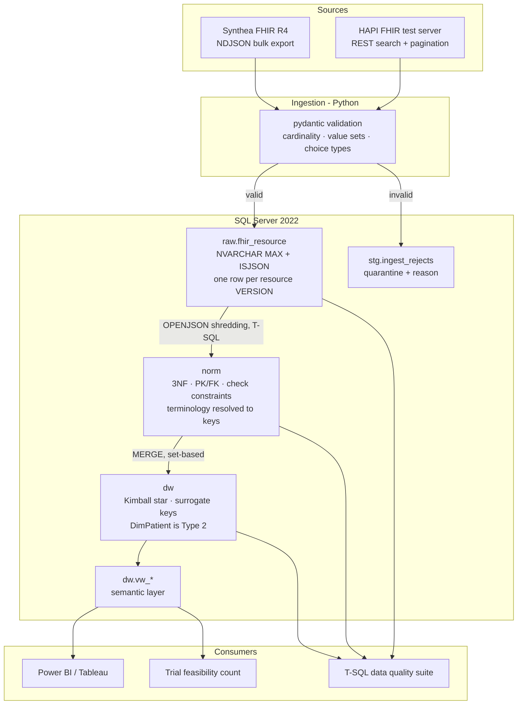

# Architecture

Why this warehouse has two modelled layers instead of one, what each of them is
for, and what the arrangement costs.

## The shape

## Why a normalised layer feeds a dimensional one

The short version: **the two layers answer different questions, and neither can
answer the other's.**

A dimensional model is a *reporting* shape. It denormalises on purpose,
it carries surrogate keys so history can be versioned, and its measures are
pre-computed so a dashboard tile is a `SUM` rather than a seven-table join. All
of that makes it fast and legible to a report author. It also makes it
structurally unable to enforce the thing a source system cares most about:
`FactEncounter` cannot tell you whether an encounter referenced a patient who
does not exist, because every reference in it has already been resolved to a
surrogate key — and if the resolution failed, the row is pointing at the
Unknown member and looks perfectly valid.

Something has to refuse that row rather than report on it, and that something
has to be a model with real keys and real constraints. That is what `norm` is.
Its foreign keys are declared, enabled and trusted, its `NOT NULL` columns match
the FHIR elements the specification marks 1..1, and its check constraints carry
the required value sets. A resource that violates any of them does not get a
softer landing; it is quarantined in `stg.ingest_rejects` with the reason.

The reverse argument holds too. If you keep only the normalised model and let
reports run against it:

- Every question needs the joins. "Encounter volume by care setting by month"
  crosses six tables in 3NF and two in the star. The joins get copied into
  fourteen reports and one of them gets it wrong.
- **You cannot answer "what was true at the time."** A patient's address in
  `norm.patient_address` is their *current* address. The encounter they had two
  years ago, before they moved, will be attributed to their new health region
  forever. That is what `DimPatient`'s Type 2 history exists for, and there is
  nowhere in a normalised transactional model to put it without inventing
  effective-dating on every table.
- Aggregations scan tables designed for single-row lookups.

So: one layer that refuses bad data, one layer that answers questions quickly,
and a load between them that is set-based, idempotent, and re-runnable.

### Where this pattern appears

Normalised-then-dimensional is the standard enterprise warehouse pattern, not
anything invented here. Kimball describes the dimensional half; Inmon's
Corporate Information Factory is the argument for the normalised half feeding
it; the "medallion" bronze/silver/gold framing is the same idea with newer
names. Healthcare warehouses land on it particularly often because clinical
source data arrives as deeply nested documents that have to be shredded before
they can be constrained, and because clinical reporting is unusually dependent
on point-in-time correctness — a readmission rate computed against a patient's
*current* attributes is a different number from one computed against the
attributes they had on admission.

Every major clinical warehousing product implements some version of it. This
repository implements the pattern from first principles against an open
specification; it is not a reimplementation of any vendor's schema, and it does
not reproduce any vendor's table names, column names or documentation.

## What it costs

Stated plainly, because a design document that only lists benefits is a sales
brochure:

| Cost | Detail |
|---|---|
| Two loads, not one | Every field is written twice — `raw` → `norm`, `norm` → `dw`. On this extract that is about 1.7 million rows shredded and 1.4 million fact rows built. |
| Storage | Three copies of the same clinical fact: the source JSON, the 3NF row, the fact row. `raw` is the largest by a wide margin, and keeping it is a deliberate choice: it is the only layer that can answer "what did the source actually send". |
| Latency | Nothing reaches a report until both loads have run. A single-layer design would be faster to update. |
| Two places to change | Adding a FHIR element means a `norm` column, a shredding change, and usually a `dw` column too. `docs/lineage.py` exists so the second and third are not forgotten. |
| More surface to test | Hence the reconciliation checks: `raw` → `norm` must be exact, `norm` → `dw` must be exact except for the one documented grain change. |

The cost is worth paying at this shape of problem — nested source documents,
point-in-time reporting, a regulatory audience — and would not be worth paying
for a flat CSV feed with no history requirement. It is a judgement about the
data, not a rule.

## Decisions worth defending

**Shredding is T-SQL, not Python.** The mapping from a FHIR element path to a
column is the artefact a reviewer or an auditor needs, and it belongs in the
repository as a queryable object rather than a dictionary walk that exists only
at runtime. It also keeps the work where the data is: `OPENJSON` over a million
rows inside the engine beats a million round trips out of it by orders of
magnitude.

**Only `DimPatient` is Type 2.** Type 2 everywhere is a common and expensive
default. It is worth its cost exactly where "what was true at the time" changes
the answer: a patient moving between health regions changes which region an
encounter counts against, so it is tracked. A clinician's name being corrected
does not, so `DimProvider` is Type 1 and its corrections apply retroactively —
which is what you want from a correction.

**Late-arriving dimensions are inferred, not deferred.** A fact whose dimension
member has not arrived gets a stub row with the business key and
`is_inferred = 1`, and a real surrogate key immediately. When the record
arrives, the stub is updated in place, so every fact already pointing at it
becomes correct without being rewritten. Holding the fact back instead means a
report that is silently missing yesterday's admissions — the failure nobody
sees.

**Terminology is resolved to keys, not stored as strings.** Every coded value in
FHIR is a `(system, code, display)` triple and the system is the part that gets
dropped. A `code` column holding `8302-2` with no system is ambiguous the moment
a second vocabulary arrives, and in clinical data a second vocabulary always
arrives. The cost is a join; the benefit is that "how many diabetes diagnoses"
cannot be answered by matching a string against the wrong vocabulary.

**`raw` is never edited and never deleted.** It is the only layer that can
answer "what did the source actually send", which is the first question asked
when a number is disputed. It is also what makes the pipeline re-runnable from
scratch without going back to the source system.

**The reference resolver handles conditional references.** Synthea — like plenty
of real integrations — writes
`Practitioner?identifier=http://hl7.org/fhir/sid/us-npi|9999979393` rather than
`Practitioner/<id>`, and the NPI in that string never matches the Practitioner's
resource id. A resolver that assumes the literal form loads everything
successfully and leaves every encounter without a clinician: every row count
correct, every foreign key valid, the provider dimension decorative. Hence
`norm.practitioner_identifier` and `norm.organization_identifier`, and a test
that asserts an NPI never equals a resource id.

## The layer boundaries, and their expected variances

| Boundary | Rule | Why |
|---|---|---|
| source → `raw` | Every valid resource lands; every invalid one is quarantined with a reason. Nothing is dropped. | The quarantine is the contract. `read = accepted + duplicate + rejected` is asserted per batch. |
| `raw` → `norm` | **Exact equality**, per resource type. | A resource that landed and did not shred was lost. There is no acceptable variance here and the DQ suite treats any difference as a failure. |
| `norm` → `dw` | Exact equality for encounters, conditions, procedures, medication orders. | Same grain on both sides. |
| `norm.observation` → `dw.FactObservation` | `FactObservation = observations carrying a value + observation components` | The fact grain is **one result**. A blood pressure is one Observation with two components and therefore two facts; a 21-item panel is 21. An observation carrying no value at all — the container row Synthea emits for a panel — produces none. Checked as an exact identity, not with a tolerance. |

## Terminology scope

`norm.code_system` and `norm.code_concept` are a reference *structure*, seeded
with the subset of codes the extract actually contains, discovered from the
data. They are not a terminology server and they do not ship LOINC, SNOMED CT or
ICD-10-CA content — all three are licensed and cannot be redistributed. Display
text comes from the FHIR resources themselves, which is what the source system
asserted rather than what the publisher's release file says.

ICD-10-CA is registered as a code system because it is the vocabulary Canadian
acute care reports to CIHI, and a warehouse built for that audience needs
somewhere to put a crosswalk. **No crosswalk is implemented**: mapping SNOMED CT
to ICD-10-CA correctly requires the licensed maps, and a hand-rolled
approximation of a reimbursement-relevant mapping would be worse than none.

## Related documents

- [`data-dictionary.md`](data-dictionary.md) — every table and column, generated from the live schema
- [`data-map.md`](data-map.md) — FHIR element → `norm` → `dw`, with a lineage diagram
- [`erd.md`](erd.md) — entity relationship diagrams for both modelled layers
- [`performance.md`](performance.md) — three queries, measured before and after one specific change each
- [`../powerbi/measures.md`](../powerbi/measures.md) — the DAX a report model sits on, and the filter-context decisions behind it
