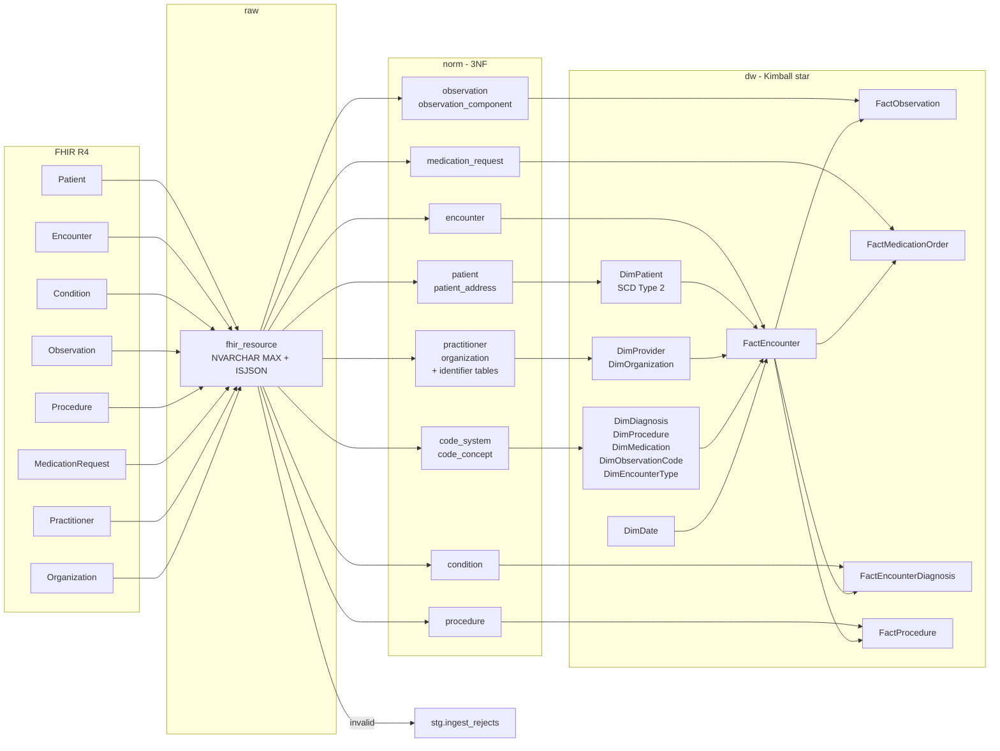

# Data map

<!-- Generated by docs/build_docs.py. Edits here are overwritten; the prose
     lives in docs/lineage.py and in the SQL files themselves. -->

FHIR element &rarr; `norm` column &rarr; `dw` column, for every field the warehouse carries.

Generated from `docs/lineage.py`, which is checked against the live schema by `tests/test_docs.py`: a column added without an entry here fails the build, and an entry naming a column that no longer exists fails it too. A data map nobody verifies is a data map that was accurate once.

`[0]` means the warehouse takes the first of a repeating element; `[*]` means it takes all of them, into a child table.

## Lineage

## Field-level map

### Condition

| FHIR element | `norm` | `dw` | Notes |
|---|---|---|---|
| `id` | `norm.condition.condition_id` | `dw.FactEncounterDiagnosis.condition_id` |  |
| `subject.reference` | `norm.condition.patient_id` | `dw.FactEncounterDiagnosis.patient_key` |  |
| `encounter.reference` | `norm.condition.encounter_id` | `dw.FactEncounterDiagnosis.encounter_key` |  |
| `code.coding[0]` | `norm.condition.code_concept_id` | `dw.FactEncounterDiagnosis.diagnosis_key` | SNOMED CT. NOT NULL — an uncoded condition is quarantined rather than loaded as an Unknown diagnosis that would inflate every count. |
| `clinicalStatus.coding[0].code` | `norm.condition.clinical_status` | `dw.FactEncounterDiagnosis.clinical_status` |  |
| `verificationStatus.coding[0].code` | `norm.condition.verification_status` | — |  |
| `onsetDateTime` | `norm.condition.onset_datetime` | `dw.FactEncounterDiagnosis.onset_date_key` |  |
| `abatementDateTime` | `norm.condition.abatement_datetime` | — |  |
| `recordedDate` | `norm.condition.recorded_date` | — | Used as the onset date when onsetDateTime is absent. |

### Encounter

| FHIR element | `norm` | `dw` | Notes |
|---|---|---|---|
| `id` | `norm.encounter.encounter_id` | `dw.FactEncounter.encounter_id` | Degenerate dimension — a business key carried on the fact with no dimension table behind it. |
| `subject.reference` | `norm.encounter.patient_id` | `dw.FactEncounter.patient_key` | Literal reference (Patient/<id>). Resolved to the patient version current at period_start, not to the version current now. |
| `status` | `norm.encounter.status` | `dw.FactEncounter.encounter_status` | 1..1. Required value set. |
| `class.code` | `norm.encounter.class_code` | `dw.DimEncounterType.class_code` | 1..1, and a bare Coding rather than a CodeableConcept — there is no .coding array to descend into. |
| `class.display` | `norm.encounter.class_display` | `dw.DimEncounterType.class_display` |  |
| `type[0].coding[0]` | `norm.encounter.type_code_concept_id` | `dw.DimEncounterType.type_code` |  |
| `period.start` | `norm.encounter.period_start` | `dw.FactEncounter.start_date_key` | Looked up in DimDate rather than computed, so a date outside the dimension degrades to Unknown instead of failing the foreign key and the whole load. |
| `period.end` | `norm.encounter.period_end` | `dw.FactEncounter.end_date_key` |  |
| `serviceProvider.reference` | `norm.encounter.service_provider_id` | `dw.FactEncounter.organization_key` | CONDITIONAL reference: Organization?identifier=<system>|<value>. Resolved via norm.organization_identifier. |
| `participant[*].individual.reference` | `norm.encounter.primary_performer_id` | `dw.FactEncounter.provider_key` | CONDITIONAL reference on NPI. The participant whose type is PPRF is preferred; the list also holds admitters and translators. |

### MedicationRequest

| FHIR element | `norm` | `dw` | Notes |
|---|---|---|---|
| `id` | `norm.medication_request.medication_request_id` | `dw.FactMedicationOrder.medication_request_id` |  |
| `subject.reference` | `norm.medication_request.patient_id` | `dw.FactMedicationOrder.patient_key` |  |
| `encounter.reference` | `norm.medication_request.encounter_id` | `dw.FactMedicationOrder.encounter_key` |  |
| `status` | `norm.medication_request.status` | `dw.FactMedicationOrder.order_status` | 1..1. |
| `intent` | `norm.medication_request.intent` | `dw.FactMedicationOrder.order_intent` | 1..1. |
| `medicationCodeableConcept.coding[0]` | `norm.medication_request.code_concept_id` | `dw.FactMedicationOrder.medication_key` | medication[x] branch one. RxNorm. |
| `medicationReference.reference` | `norm.medication_request.medication_reference_id` | — | medication[x] branch two, taken by 16% of the rows in this extract. A check constraint enforces exactly one branch, which is the FHIR rule written down. |
| `authoredOn` | `norm.medication_request.authored_on` | `dw.FactMedicationOrder.authored_date_key` |  |
| `requester.reference` | `norm.medication_request.requester_id` | `dw.FactMedicationOrder.provider_key` | CONDITIONAL reference on NPI. |

### Observation

| FHIR element | `norm` | `dw` | Notes |
|---|---|---|---|
| `id` | `norm.observation.observation_id` | `dw.FactObservation.observation_id` |  |
| `subject.reference` | `norm.observation.patient_id` | `dw.FactObservation.patient_key` |  |
| `encounter.reference` | `norm.observation.encounter_id` | `dw.FactObservation.encounter_key` | Nullable: a result ordered outside an encounter is legitimate. |
| `code.coding[*]` | `norm.observation.code_concept_id` | `dw.FactObservation.observation_code_key` | 1..1. LOINC preferred where a concept carries several codings; the ones not chosen are kept in norm.resource_coding rather than discarded. |
| `category[0].coding[0].code` | `norm.observation.category_code` | — |  |
| `status` | `norm.observation.status` | `dw.FactObservation.observation_status` | 1..1. |
| `effectiveDateTime` | `norm.observation.effective_datetime` | `dw.FactObservation.effective_date_key` |  |
| `issued` | `norm.observation.issued` | — |  |
| `valueQuantity.value` | `norm.observation.value_quantity` | `dw.FactObservation.value_numeric` | value[x] is a choice of eleven types; three occur here and each has its own typed column rather than one NVARCHAR holding all of them. |
| `valueQuantity.unit` | `norm.observation.value_unit` | `dw.FactObservation.value_unit` | A quantity with no unit is refused by a check constraint. |
| `valueCodeableConcept.coding[0]` | `norm.observation.value_code_concept_id` | `dw.FactObservation.value_text` |  |
| `valueString` | `norm.observation.value_string` | `dw.FactObservation.value_text` |  |
| `component[*]` | `norm.observation_component` | — | A blood pressure is one Observation with two components; a survey panel has twenty-one. |
| `component[*].code.coding[0]` | `norm.observation_component.code_concept_id` | — |  |
| `component[*].valueQuantity.value` | `norm.observation_component.value_quantity` | — |  |
| `component[*].valueQuantity.unit` | `norm.observation_component.value_unit` | — |  |
| `component[*].valueCodeableConcept.coding[0]` | `norm.observation_component.value_code_concept_id` | — |  |

### Organization

| FHIR element | `norm` | `dw` | Notes |
|---|---|---|---|
| `id` | `norm.organization.organization_id` | `dw.DimOrganization.organization_id` |  |
| `name` | `norm.organization.name` | `dw.DimOrganization.organization_name` | NOT NULL: R4 invariant org-1 requires a name or an identifier, and this warehouse requires the name. |
| `type[0].coding[0]` | `norm.organization.type_code_concept_id` | `dw.DimOrganization.organization_type` | Resolved to a concept key in norm; flattened to its display text in dw. |
| `address[0].line[0]` | `norm.organization.address_line` | — |  |
| `address[0].city` | `norm.organization.city` | `dw.DimOrganization.city` |  |
| `address[0].state` | `norm.organization.state` | `dw.DimOrganization.state` |  |
| `address[0].postalCode` | `norm.organization.postal_code` | `dw.DimOrganization.postal_code` |  |
| `address[0].country` | `norm.organization.country` | — |  |
| `active` | `norm.organization.is_active` | — |  |
| `identifier[*].system` | `norm.organization_identifier.identifier_system` | — |  |
| `identifier[*].value` | `norm.organization_identifier.identifier_value` | — |  |

### Patient

| FHIR element | `norm` | `dw` | Notes |
|---|---|---|---|
| `id` | `norm.patient.patient_id` | `dw.DimPatient.patient_id` | Business key. dw.DimPatient is keyed by a surrogate; this is the natural key that repeats across Type 2 versions. |
| `name[0].family` | `norm.patient.family_name` | — | Deliberately not carried into dw. A name is not an analytical attribute and putting it in a dimension puts it in every extract of that dimension. |
| `name[0].given[0]` | `norm.patient.given_name` | — |  |
| `birthDate` | `norm.patient.birth_date` | `dw.DimPatient.birth_date` |  |
| `gender` | `norm.patient.gender` | `dw.DimPatient.gender` | Required value set: male | female | other | unknown. |
| `maritalStatus.coding[0].code` | `norm.patient.marital_status_code` | — | The code is kept in norm; the dimension carries the display text because that is what a report renders. |
| `maritalStatus.coding[0].display` | `norm.patient.marital_status_display` | `dw.DimPatient.marital_status` | TRACKED by SCD Type 2. |
| `deceasedDateTime` | `norm.patient.deceased_datetime` | — |  |
| `meta.versionId` | `norm.patient.source_version_id` | — | Defaults to '1' when the source stamps no version, which Synthea does not. |
| `meta.lastUpdated` | `norm.patient.source_last_updated` | — |  |
| `address[*]` | `norm.patient_address` | — | 0..* in FHIR, so it is a child table, not columns on the patient. |
| `address[*].line[0]` | `norm.patient_address.address_line` | — |  |
| `address[*].city` | `norm.patient_address.city` | `dw.DimPatient.address_city` | TRACKED by SCD Type 2. The dimension carries the first address; norm keeps all of them. |
| `address[*].state` | `norm.patient_address.state` | `dw.DimPatient.address_state` | TRACKED by SCD Type 2. |
| `address[*].postalCode` | `norm.patient_address.postal_code` | `dw.DimPatient.address_postal_code` | TRACKED by SCD Type 2. |
| `address[*].country` | `norm.patient_address.country` | — |  |
| `address[*].use` | `norm.patient_address.address_use` | — |  |

### Practitioner

| FHIR element | `norm` | `dw` | Notes |
|---|---|---|---|
| `id` | `norm.practitioner.practitioner_id` | `dw.DimProvider.practitioner_id` |  |
| `name[0].family` | `norm.practitioner.family_name` | — |  |
| `name[0].given[0]` | `norm.practitioner.given_name` | — |  |
| `name[0].prefix[0]` | `norm.practitioner.name_prefix` | — |  |
| `gender` | `norm.practitioner.gender` | `dw.DimProvider.gender` |  |
| `active` | `norm.practitioner.is_active` | — |  |
| `identifier[*].system` | `norm.practitioner_identifier.identifier_system` | — |  |
| `identifier[*].value` | `norm.practitioner_identifier.identifier_value` | `dw.DimProvider.npi` | The NPI. This table is what makes conditional references resolvable — the value in Practitioner?identifier=<system>|<npi> is NOT the resource id. |

### Procedure

| FHIR element | `norm` | `dw` | Notes |
|---|---|---|---|
| `id` | `norm.procedure.procedure_id` | `dw.FactProcedure.procedure_id` |  |
| `subject.reference` | `norm.procedure.patient_id` | `dw.FactProcedure.patient_key` |  |
| `encounter.reference` | `norm.procedure.encounter_id` | `dw.FactProcedure.encounter_key` |  |
| `code.coding[0]` | `norm.procedure.code_concept_id` | `dw.FactProcedure.procedure_key` | SNOMED CT. |
| `status` | `norm.procedure.status` | `dw.FactProcedure.procedure_status` |  |
| `performedDateTime | performedPeriod.start` | `norm.procedure.performed_start` | `dw.FactProcedure.performed_date_key` | performed[x] is a choice; both branches are coalesced, because a procedure with a period and no dateTime is not a procedure with no date. |
| `performedPeriod.end` | `norm.procedure.performed_end` | — |  |

### (derived and generated)

| FHIR element | `norm` | `dw` | Notes |
|---|---|---|---|
| _derived_ | — | `dw.DimPatient.age_band` | Banded from birth_date at load time: 00-17 / 18-44 / 45-64 / 65-79 / 80+. |
| _derived_ | — | `dw.DimPatient.effective_from` | SCD2. The first version opens at 1900-01-01, not the load date — see sql/11_load_dw.sql for why that distinction decides whether the dimension works. |
| _derived_ | — | `dw.DimPatient.effective_to` | SCD2. 9999-12-31 while current; otherwise the day before the successor opens. |
| _derived_ | — | `dw.DimPatient.is_current` |  |
| _derived_ | — | `dw.DimPatient.version_number` |  |
| _derived_ | — | `dw.DimPatient.row_hash` | SHA2_256 over the tracked attributes only, delimited and NULL-marked. |
| _derived_ | — | `dw.DimPatient.is_inferred` | 1 while the patient exists only because a fact referenced them. |
| _derived_ | — | `dw.DimPatient.patient_key` | Surrogate key. IDENTITY; -1 is Unknown. |
| _derived_ | — | `dw.DimProvider.full_name` | prefix + given + family, concatenated at load time. |
| _derived_ | — | `dw.DimProvider.provider_key` | Surrogate key; -1 is Unknown. |
| _derived_ | — | `dw.DimProvider.is_inferred` | 1 for a late-arriving stub. |
| _derived_ | — | `dw.DimOrganization.organization_key` | Surrogate key; -1 is Unknown. |
| _derived_ | — | `dw.DimOrganization.is_inferred` |  |
| _derived_ | — | `dw.DimEncounterType.type_display` |  |
| _derived_ | — | `dw.DimEncounterType.care_setting` | Grouping derived from class_code: Inpatient | Emergency | Ambulatory | Virtual | Home | Other | Unknown. Derived once here rather than as a CASE in every query. |
| _derived_ | — | `dw.DimEncounterType.encounter_type_key` |  |
| _derived_ | — | `dw.DimEncounterType.is_inferred` |  |
| _derived_ | — | `dw.FactEncounter.encounter_type_key` | Foreign key to DimEncounterType, resolved from (class_code, type_code). |
| _derived_ | — | `dw.FactEncounter.length_of_stay_days` | DATEDIFF(SECOND) / 86400 — seconds, not days, so a same-day stay is a fraction rather than zero. |
| _derived_ | — | `dw.FactEncounter.length_of_stay_minutes` |  |
| _derived_ | — | `dw.FactEncounter.is_inpatient` | class_code in IMP, ACUTE, NONAC. |
| _derived_ | — | `dw.FactEncounter.is_emergency` | class_code = EMER. |
| _derived_ | — | `dw.FactEncounter.is_readmission_30d` | An inpatient admission starting within 30 days of that patient's previous inpatient discharge. Computed with LAG at load time, not in the report. |
| _derived_ | — | `dw.FactEncounter.days_since_prior_discharge` |  |
| _derived_ | — | `dw.FactEncounter.encounter_count` | Always 1; the additive count. |
| _derived_ | — | `dw.FactEncounter.encounter_key` | Surrogate key. |
| _derived_ | — | `dw.FactEncounter.load_batch_id` | meta.load_batch lineage. |
| _derived_ | — | `dw.DimDiagnosis.code_system` |  |
| _derived_ | — | `dw.DimDiagnosis.code` |  |
| _derived_ | — | `dw.DimDiagnosis.code_display` |  |
| _derived_ | — | `dw.DimDiagnosis.diagnosis_key` |  |
| _derived_ | — | `dw.DimDiagnosis.is_inferred` |  |
| _derived_ | — | `dw.FactEncounterDiagnosis.diagnosis_count` |  |
| _derived_ | — | `dw.FactEncounterDiagnosis.encounter_diagnosis_key` |  |
| _derived_ | — | `dw.FactEncounterDiagnosis.load_batch_id` |  |
| _derived_ | — | `dw.DimObservationCode.code_system` |  |
| _derived_ | — | `dw.DimObservationCode.code` |  |
| _derived_ | — | `dw.DimObservationCode.code_display` |  |
| _derived_ | — | `dw.DimObservationCode.observation_code_key` |  |
| _derived_ | — | `dw.DimObservationCode.is_inferred` |  |
| _derived_ | `norm.observation.has_components` | — |  |
| _derived_ | `norm.observation_component.observation_id` | — |  |
| _derived_ | `norm.observation_component.component_seq` | `1-based position within component[].` |  |
| _derived_ | — | `dw.FactObservation.component_seq` | 0 for the observation's own value[x]; 1..n for its components. Part of the natural key, and what makes the fact grain 'one result'. |
| _derived_ | — | `dw.FactObservation.is_numeric` |  |
| _derived_ | — | `dw.FactObservation.result_count` |  |
| _derived_ | — | `dw.FactObservation.observation_fact_key` |  |
| _derived_ | — | `dw.FactObservation.load_batch_id` |  |
| _derived_ | — | `dw.DimProcedure.code_system` |  |
| _derived_ | — | `dw.DimProcedure.code` |  |
| _derived_ | — | `dw.DimProcedure.code_display` |  |
| _derived_ | — | `dw.DimProcedure.procedure_key` |  |
| _derived_ | — | `dw.DimProcedure.is_inferred` |  |
| _derived_ | — | `dw.FactProcedure.duration_minutes` |  |
| _derived_ | — | `dw.FactProcedure.procedure_count` |  |
| _derived_ | — | `dw.FactProcedure.procedure_fact_key` |  |
| _derived_ | — | `dw.FactProcedure.load_batch_id` |  |
| _derived_ | — | `dw.DimMedication.code_system` |  |
| _derived_ | — | `dw.DimMedication.code` |  |
| _derived_ | — | `dw.DimMedication.code_display` |  |
| _derived_ | — | `dw.DimMedication.medication_key` |  |
| _derived_ | — | `dw.DimMedication.is_inferred` |  |
| _derived_ | — | `dw.FactMedicationOrder.is_active` | status = 'active'. |
| _derived_ | — | `dw.FactMedicationOrder.order_count` |  |
| _derived_ | — | `dw.FactMedicationOrder.medication_order_key` |  |
| _derived_ | — | `dw.FactMedicationOrder.load_batch_id` |  |
| `any .coding[*].system` | `norm.code_system.system_uri` | — |  |
| _derived_ | `norm.code_system.system_name` | — |  |
| _derived_ | `norm.code_system.code_system_id` | — |  |
| _derived_ | `norm.code_system.is_licensed` | — |  |
| _derived_ | `norm.code_system.notes` | — |  |
| `any .coding[*].code` | `norm.code_concept.code` | — |  |
| `any .coding[*].display` | `norm.code_concept.display` | — |  |
| _derived_ | `norm.code_concept.code_concept_id` | — |  |
| _derived_ | `norm.code_concept.code_system_id` | — |  |
| _derived_ | `norm.code_concept.first_seen_at` | — |  |
| `any .coding[*]` | `norm.resource_coding.code_concept_id` | — | Every coding, including the ones not chosen as primary. |
| _derived_ | `norm.resource_coding.resource_type` | — |  |
| _derived_ | `norm.resource_coding.resource_id` | — |  |
| _derived_ | `norm.resource_coding.coding_seq` | — |  |
| _derived_ | `norm.resource_coding.is_primary` | — |  |
| _derived_ | `norm.practitioner_identifier.practitioner_id` | — |  |
| _derived_ | `norm.organization_identifier.organization_id` | — |  |
| _derived_ | `norm.patient_address.patient_id` | — |  |
| _derived_ | `norm.patient_address.address_seq` | — |  |
| `generated` | — | `dw.DimDate.date_key` | YYYYMMDD as an integer. -1 is Unknown. |
| `generated` | — | `dw.DimDate.full_date` |  |
| `generated` | — | `dw.DimDate.day_of_month` |  |
| `generated` | — | `dw.DimDate.day_of_week` |  |
| `generated` | — | `dw.DimDate.day_name` |  |
| `generated` | — | `dw.DimDate.day_of_year` |  |
| `generated` | — | `dw.DimDate.week_of_year` | ISO week. |
| `generated` | — | `dw.DimDate.month_number` |  |
| `generated` | — | `dw.DimDate.month_name` |  |
| `generated` | — | `dw.DimDate.month_year` | YYYY-MM, so text sorts chronologically. |
| `generated` | — | `dw.DimDate.quarter_number` |  |
| `generated` | — | `dw.DimDate.quarter_name` |  |
| `generated` | — | `dw.DimDate.year_number` |  |
| `generated` | — | `dw.DimDate.is_weekend` |  |
| `generated` | — | `dw.DimDate.fiscal_year` | Health-sector fiscal year, starting 1 April. |
| `generated` | — | `dw.DimDate.fiscal_quarter` | 1 = Apr-Jun. |

---

Generated against Developer Edition 16.0.4265.3.
