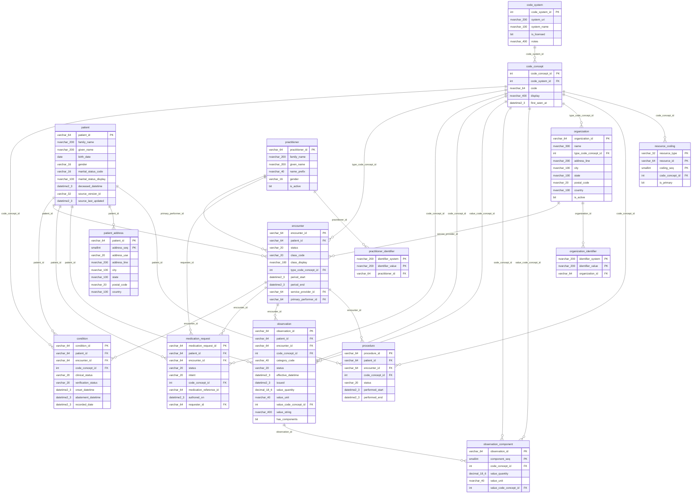

# Entity relationship diagrams

<!-- Generated by docs/build_docs.py. Edits here are overwritten; the prose
     lives in docs/lineage.py and in the SQL files themselves. -->

Both diagrams are generated from `sys.columns` and `sys.foreign_keys`, so they show the relationships the engine is actually enforcing rather than the ones someone meant to create.

## `norm` — the normalised transactional model

Every relationship above is a declared foreign key. That is the point of this layer: it is the only place in the pipeline where an encounter referencing a patient who does not exist is refused rather than reported on.

## `dw` — the dimensional model

```mermaid
erDiagram
    DimDate {
        int date_key PK
        date full_date
        tinyint day_of_month
        tinyint day_of_week
        varchar_10 day_name
        smallint day_of_year
        tinyint week_of_year
        tinyint month_number
        varchar_10 month_name
        char_7 month_year
        tinyint quarter_number
        char_7 quarter_name
        smallint year_number
        bit is_weekend
        smallint fiscal_year
        tinyint fiscal_quarter
    }
    DimDiagnosis {
        int diagnosis_key PK
        nvarchar_100 code_system
        nvarchar_64 code
        nvarchar_400 code_display
        bit is_inferred
    }
    DimEncounterType {
        int encounter_type_key PK
        varchar_20 class_code
        nvarchar_100 class_display
        nvarchar_64 type_code
        nvarchar_400 type_display
        varchar_20 care_setting
        bit is_inferred
    }
    DimMedication {
        int medication_key PK
        nvarchar_100 code_system
        nvarchar_64 code
        nvarchar_400 code_display
        bit is_inferred
    }
    DimObservationCode {
        int observation_code_key PK
        nvarchar_100 code_system
        nvarchar_64 code
        nvarchar_400 code_display
        bit is_inferred
    }
    DimOrganization {
        int organization_key PK
        varchar_64 organization_id
        nvarchar_300 organization_name
        nvarchar_200 organization_type
        nvarchar_100 city
        nvarchar_100 state
        nvarchar_20 postal_code
        bit is_inferred
    }
    DimPatient {
        bigint patient_key PK
        varchar_64 patient_id
        date birth_date
        varchar_16 gender
        varchar_12 age_band
        nvarchar_100 marital_status
        nvarchar_100 address_city
        nvarchar_100 address_state
        nvarchar_20 address_postal_code
        date effective_from
        date effective_to
        bit is_current
        int version_number
        binary_32 row_hash
        bit is_inferred
    }
    DimProcedure {
        int procedure_key PK
        nvarchar_100 code_system
        nvarchar_64 code
        nvarchar_400 code_display
        bit is_inferred
    }
    DimProvider {
        int provider_key PK
        varchar_64 practitioner_id
        nvarchar_200 npi
        nvarchar_300 full_name
        varchar_16 gender
        bit is_inferred
    }
    FactEncounter {
        bigint encounter_key PK
        varchar_64 encounter_id
        bigint patient_key FK
        int provider_key FK
        int organization_key FK
        int encounter_type_key FK
        int start_date_key FK
        int end_date_key FK
        varchar_20 encounter_status
        tinyint encounter_count
        decimal_10_4 length_of_stay_days
        int length_of_stay_minutes
        bit is_inpatient
        bit is_emergency
        bit is_readmission_30d
        int days_since_prior_discharge
        bigint load_batch_id
    }
    FactEncounterDiagnosis {
        bigint encounter_diagnosis_key PK
        varchar_64 condition_id
        bigint encounter_key FK
        bigint patient_key FK
        int diagnosis_key FK
        int onset_date_key FK
        varchar_20 clinical_status
        tinyint diagnosis_count
        bigint load_batch_id
    }
    FactMedicationOrder {
        bigint medication_order_key PK
        varchar_64 medication_request_id
        bigint patient_key FK
        bigint encounter_key FK
        int provider_key FK
        int medication_key FK
        int authored_date_key FK
        varchar_20 order_status
        varchar_20 order_intent
        tinyint order_count
        bit is_active
        bigint load_batch_id
    }
    FactObservation {
        bigint observation_fact_key PK
        varchar_64 observation_id
        smallint component_seq
        bigint patient_key FK
        bigint encounter_key FK
        int observation_code_key FK
        int effective_date_key FK
        varchar_20 observation_status
        tinyint result_count
        decimal_18_6 value_numeric
        nvarchar_40 value_unit
        nvarchar_400 value_text
        bit is_numeric
        bigint load_batch_id
    }
    FactProcedure {
        bigint procedure_fact_key PK
        varchar_64 procedure_id
        bigint patient_key FK
        bigint encounter_key FK
        int procedure_key FK
        int performed_date_key FK
        varchar_20 procedure_status
        tinyint procedure_count
        int duration_minutes
        bigint load_batch_id
    }
    DimDate ||--o{ FactEncounter : start_date_key
    DimDate ||--o{ FactEncounter : end_date_key
    DimEncounterType ||--o{ FactEncounter : encounter_type_key
    DimOrganization ||--o{ FactEncounter : organization_key
    DimPatient ||--o{ FactEncounter : patient_key
    DimProvider ||--o{ FactEncounter : provider_key
    DimDate ||--o{ FactEncounterDiagnosis : onset_date_key
    DimDiagnosis ||--o{ FactEncounterDiagnosis : diagnosis_key
    DimPatient ||--o{ FactEncounterDiagnosis : patient_key
    FactEncounter ||--o{ FactEncounterDiagnosis : encounter_key
    DimDate ||--o{ FactMedicationOrder : authored_date_key
    DimMedication ||--o{ FactMedicationOrder : medication_key
    DimPatient ||--o{ FactMedicationOrder : patient_key
    DimProvider ||--o{ FactMedicationOrder : provider_key
    FactEncounter ||--o{ FactMedicationOrder : encounter_key
    DimDate ||--o{ FactObservation : effective_date_key
    DimObservationCode ||--o{ FactObservation : observation_code_key
    DimPatient ||--o{ FactObservation : patient_key
    FactEncounter ||--o{ FactObservation : encounter_key
    DimDate ||--o{ FactProcedure : performed_date_key
    DimPatient ||--o{ FactProcedure : patient_key
    DimProcedure ||--o{ FactProcedure : procedure_key
    FactEncounter ||--o{ FactProcedure : encounter_key
```

Five fact tables around conformed dimensions. `DimPatient` is the only Type 2 dimension; the facts join to it on a date range rather than on `is_current`, which is what makes the history mean anything.

---

Generated against Developer Edition 16.0.4265.3.
